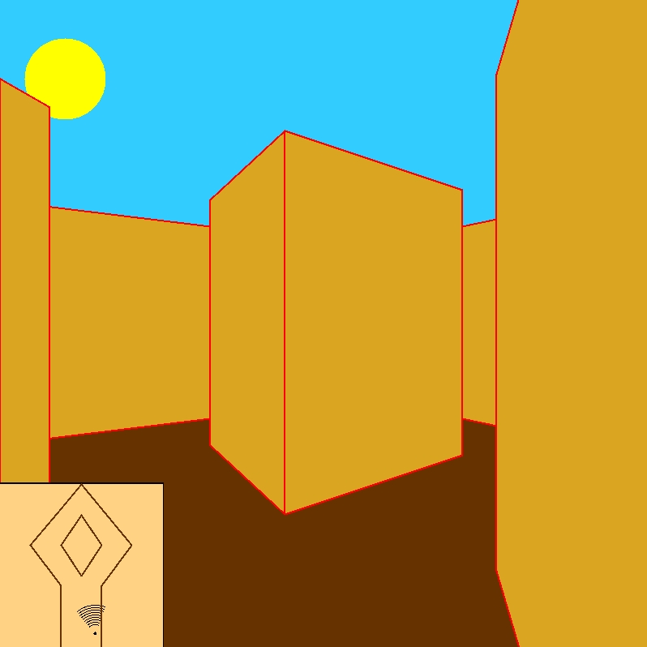

**<h1 align="center">Doom motor in OCaml</h1>**

***
## Install
  Use `git clone` and `make` in main folder
  
## Usage
  `./projet_pfa [map_path] [options]`
  
## Keys

#### FR mode

  - **`ESC`** : _quit_
  - **`z`** : _move forward_
  - **`q`** : _move left_ 
  - **`d`** : _move right_
  - **`s`** : _move back_
  - **`a`** : _rotate left_
  - **`e`** : _rotate right_
  - **`c`** : _change between 2D and 3D view_
  - **`l`** : _change language between US and FR_
  - **`m`** : _toggle minimap_
  - **`p`** _and_ **`o`** : _change player view_ 

#### US mode

  - **`w`** : _move forward_
  - **`a`** : _move left_
  - **`q`** : _rotate left_

>_the other keys are unchanged_
  
## Options

  - [x] `-mode` \<2D | 3D\> 2D or 3D display
  
  - [x] `-lang` \<FR | US\> FR or US lang
  
  - [x] `-fov` \<NUMBER\> field of vision (angle de vision)
  
  - [x] `-hov` \<NUMBER\> height of vision (hauteur de vision)
  
  - [x] `-rs` \<NUMBER\> rotation speed
  
  - [x] `-scale` \<NUMBER\> scale of the 2D map

  - [x] `-map` set a minimap in the lower left corner
  
  - [x] `-step` \<NUMBER\> set the distance between two steps
  
  - [x] `-time` \<Day | Night\> Day or Night display
  
  - [x] `-persp` \<FPS | RPS\> FPS or RPS perspective

## Collision Solution

  Collisions are managed first by calculating the player's new position and then by searching the existence of an intersection between the walls (segments) and the player's movement (speed vector).
  
## Bugs

  - The player can pass through some corners.
  - When the player and some walls are very close, with a certain angle, to each other, the wall disappears. But the player cannot cross.

## Thanks

  Big thanks to [Mr.Roux](https://www.lri.fr/~roux) for debugging and explanations
  
***

<b>By <a href="https://github.com/Xritrios">Dimitrios Christaras-Papageorgiou</a> & <a href="https://github.com/tiger008">Thomas Perraut</b></a>

